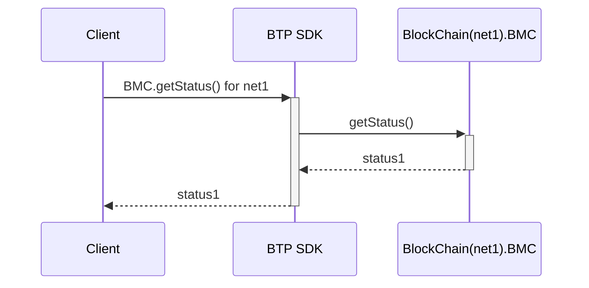

# BTP SDK

BTP SDK is the server for simplifying interactions with blockchains.

It handles blockchain-specific protocols instead of the client.
It enables more complex features based on aggregated
information from heterogeneous blockchains like BTP Message Explorer.

Refer other tools
* [BTP Message Explorer](https://github.com/icon-project/btp-tracker-frontend)
* [BTP SDK Client JS](https://github.com/icon-project/btpsdk-client-js)
